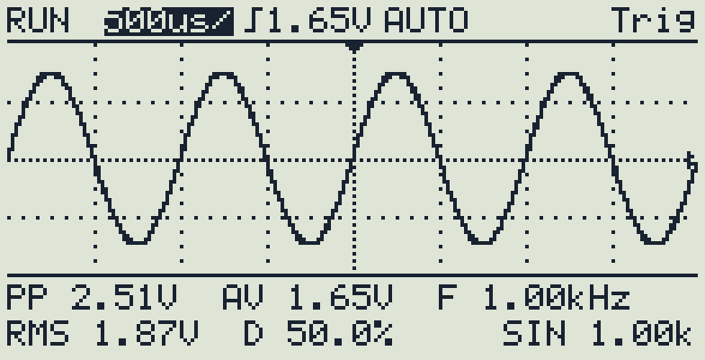
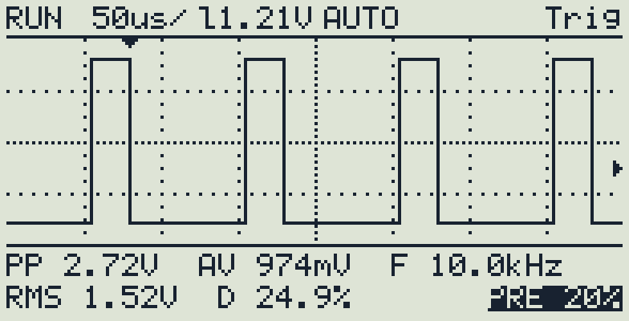
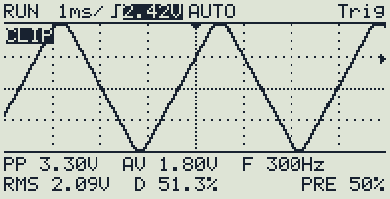
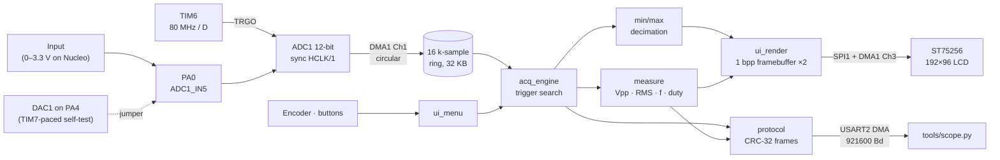
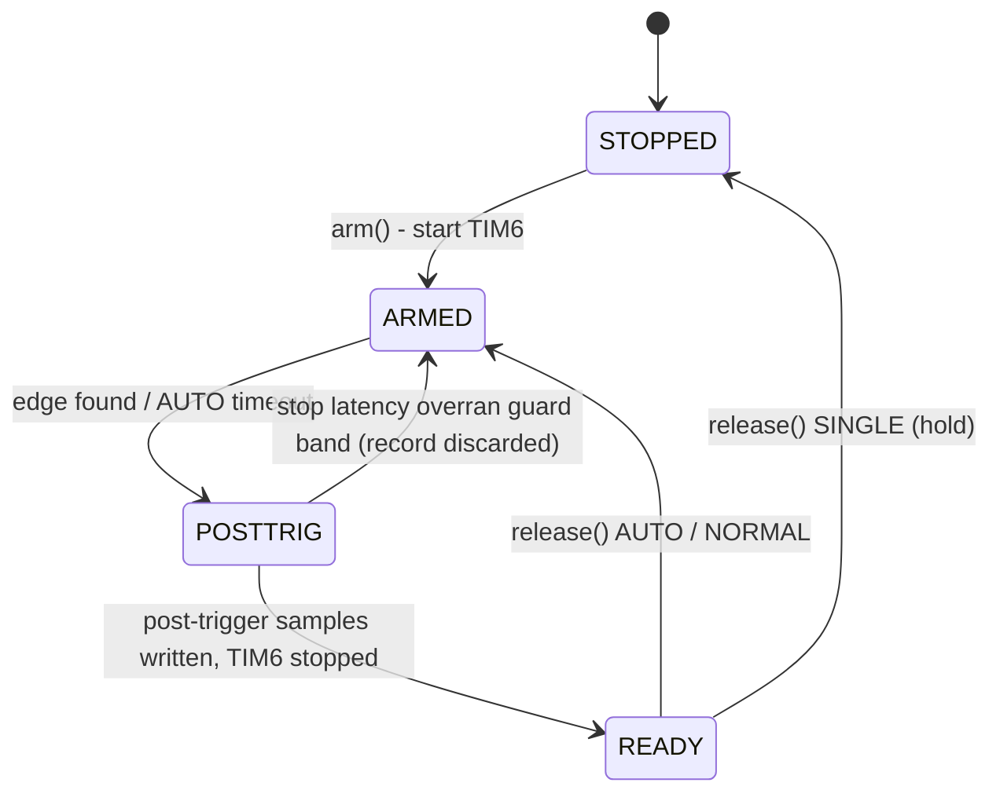

# STM32L432 Portable Oscilloscope

A bare-metal digital storage oscilloscope for the **STM32L432KC** (Cortex-M4F, 80 MHz). Timer-paced 12-bit sampling runs at up to 5 MS/s through DMA into a 16 k-sample ring. On top of that sit a software edge trigger with pre-trigger history, automatic measurements, a 192×96 ST75256 LCD driven by SPI DMA, and a CRC-checked binary protocol with a Python host utility.

The project is built to be *measured, not claimed*. Each performance figure is either derived from the clock tree (and labelled as such) or waits for a result in the [validation plan](docs/validation-plan.md).

<p align="center">
  
  
  
</p>
<p align="center"><sub>Screens drawn by the unmodified firmware UI code on a PC
(<a href="tools/render_preview.c">tools/render_preview.c</a>) from a simulated
input. They are not photos of hardware. Left to right: 1 kHz sine at 500 µs/div;
10 kHz 25 % square on a falling edge with 20 % pre-trigger; a clipped triangle
with the trigger level being edited.</sub></p>

---

## Highlights

- **Deterministic acquisition.** TIM6 TRGO → ADC1 (synchronous clock) → DMA1
  circular. The CPU does no work per sample, and every sample rate is an exact
  integer division of an LSE-disciplined 80 MHz clock.
- **Trigger engine with guaranteed record integrity.** Rising/falling edge with
  hysteresis, 10–90 % pre-trigger, AUTO/NORMAL/SINGLE and sub-sample trigger
  interpolation. The engine counts and discards any record that the DMA writer
  could have overwritten; records are never shown corrupted.
- **Race-free 32-bit DMA position.** Built from CNDTR plus a lap counter, and it
  handles the window where the hardware has already reloaded CNDTR but the
  transfer-complete ISR has not run yet.
- **Non-blocking everything.** A cooperative superloop in which ISRs only set
  flags. The display is double-buffered and sent with SPI DMA; the PC link uses
  a UART DMA TX queue and circular DMA RX. The worst-case loop time is measured
  with the DWT cycle counter.
- **Measurements:** Vpp, mean, RMS, frequency/period (interpolated edges) and
  duty cycle, plus min/max decimation so single-sample glitches stay visible.
- **PC link:** framed binary protocol with CRC-32 computed by the STM32 CRC unit
  (bit-exact with `zlib`). Captures stream as chunked, CRC-checked records while
  acquisition is held.
- **Reliability:** independent watchdog, VREFINT-based supply measurement,
  a versioned and CRC-protected settings/calibration record in flash, and a boot
  self-check that refuses to run if a CubeMX regeneration broke a critical setting.

## Architecture



Acquisition state machine (`Core/App/acq_engine.c`):



Superloop order: **acquisition → PC commands → buttons/encoder → PC TX (capture
streaming) → display → watchdog/statistics**. No step blocks. The reasoning
behind each choice is in [docs/design-decisions.md](docs/design-decisions.md).

## Specifications

| Parameter | Value | Status |
|---|---|---|
| Resolution | 12 bit | by design |
| Max sample rate | 5.00 MS/s (80 MHz / 16, 2.5-cycle sampling) | by design; accuracy to be measured (V1) |
| Time bases | 5 µs/div … 500 ms/div, 16 steps | by design ([table](Core/App/timebase_table.c)) |
| Record length | up to 15 360 samples (16 384 ring − 1024 guard) | by design |
| Trigger | rising/falling, hysteresis, 10–90 % pre-trigger, AUTO/NORMAL/SINGLE | implemented, unit-tested |
| Input range (Nucleo) | 0 – 3.3 V direct to PA0, no protection | by design |
| Input range (Rev A) | ±30 V / ±50 V attenuated | planned front end |
| Analog bandwidth (−3 dB) | – | **not measured yet** (V2) |
| Noise floor, ENOB | – | **not measured yet** (V4, V5) |
| Display refresh | 25 FPS target | to be measured (V9) |
| Flash / RAM | ≈ 52 KB / ≈ 50 KB (incl. 4 KB stack) of 254 KB / 64 KB | from the linker map |

## Repository layout

```
Core/App/           application (everything hand-written lives here)
  acq_engine.*      trigger/acquisition state machine          (portable, tested)
  trigger.*         hysteresis edge search on a ring buffer    (portable, tested)
  measure.*         Vpp / mean / RMS / period / duty           (portable, tested)
  decimate.*        min/max column decimation                  (portable, tested)
  protocol.*, crc32.*  framing + CRC shared with the host       (portable, tested)
  timebase*.c       time/div table, generated by tools/gen_timebase.py
  gfx.*, font5x7.c, ui_render.*, ui_menu.*, ui_format.*       (portable, tested)
  calib.*, scope_settings.*   ranges, VREFINT, user settings   (portable, tested)
  acq_hw.*          TIM6/ADC/DMA control, race-free write position   (STM32)
  lcd_st75256.*     ST75256 init + SPI DMA frame transfer            (STM32)
  link_uart.*       UART DMA RX ring, TX packet queue, HW CRC        (STM32)
  input.*, siggen.*, settings_store.*, hal_callbacks.c, app.*        (STM32)
Core/Src, Core/Inc  CubeMX-generated init (user code only inside USER CODE blocks)
tests/              host unit tests + test harness (CMake/CTest)
tools/              scope.py host utility, protocol module, generators, previews
docs/               design decisions, protocol, validation plan, bring-up, audit
osciloscope.ioc     CubeMX project (NUCLEO-L432KC)
```

Hardware-independent modules never include HAL headers. They reach the
hardware through small interfaces (for example `acq_hw_ops_t`), so the same code
runs on the target and in the host tests.

## Building

**STM32CubeIDE:** *File → Import → Existing Projects into Workspace*, select this
folder, then build and debug as usual. `Core/App` is compiled because `Core` is
already a source folder.

**Command line / CI** (GNU Arm Embedded toolchain, CMake ≥ 3.20):

```sh
cmake -B build -G Ninja -DCMAKE_TOOLCHAIN_FILE=cmake/arm-none-eabi.cmake
cmake --build build                       # build/scope.elf, .hex, .bin, .map
STM32_Programmer_CLI -c port=SWD -w build/scope.hex -rst    # or: st-flash
```

**Host tests:**

```sh
cmake -S tests -B build-tests && cmake --build build-tests
ctest --test-dir build-tests --output-on-failure
python3 -m unittest discover -s tools/tests
```

## Host utility

```sh
pip install -r tools/requirements.txt
python3 tools/scope.py info                   # firmware, time-base table, UID
python3 tools/scope.py timebase 6             # 500 us/div
python3 tools/scope.py trigger --level 1.2 --edge falling --mode normal --pre 20
python3 tools/scope.py gen sine 1000          # DAC test signal on PA4
python3 tools/scope.py capture -o cap.csv --plot
python3 tools/scope.py status                 # state + every runtime counter
python3 tools/scope.py selftest --report docs/validation/V11/report.md
```

`selftest` runs the automated end-to-end check with a PA4 → PA0 jumper. It
exchanges random-payload PINGs, sends a deliberately corrupted frame, then
captures 9 generator waveform/frequency combinations and checks each frequency
with an estimator written independently of the firmware's.

## Hardware

| Signal | Nucleo pin | | Signal | Nucleo pin |
|---|---|---|---|---|
| Scope input | A0 (PA0) | | LCD SCK / MOSI | A1 / A6 |
| DAC test out | A3 (PA4) | | LCD CS / A0 / RST | D3 / D6 / D12 |
| Encoder A / B / push | D9 / D1 / D0 | | Backlight PWM | A2 |
| RUN / SINGLE / MENU | D11 / D5 / D4 | | Timing probes | D10, D2 |

Full pin map, clock tree and the planned ±30/±50 V front end:
[docs/hardware.md](docs/hardware.md). First power-on steps:
[docs/bringup-checklist.md](docs/bringup-checklist.md).

> **Safety:** on the Nucleo prototype PA0 connects straight to the MCU. Apply
> only 0–3.3 V from a low-impedance source. Even with the planned front end,
> this is a low-voltage electronics instrument and not rated for mains.

## License

MIT for the application code, tools and docs (see [LICENSE](LICENSE)). The STM32
HAL and CMSIS under `Drivers/` keep their original ST/ARM licenses.
