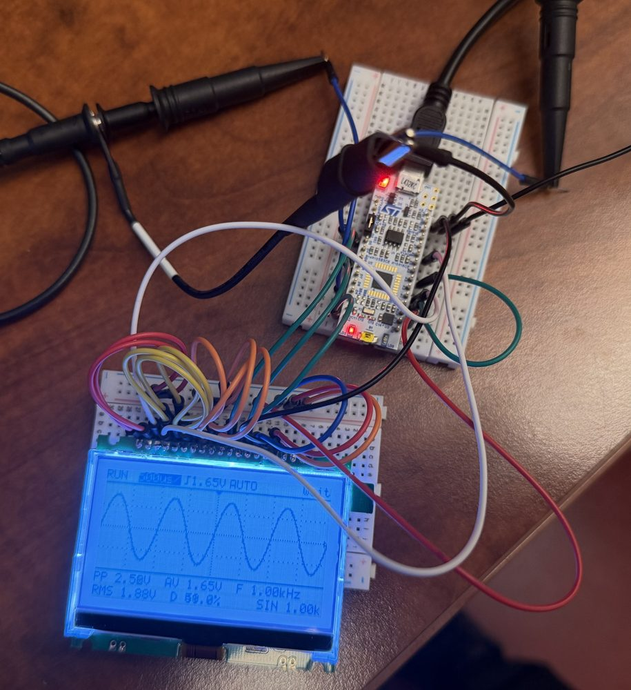
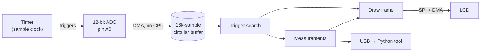
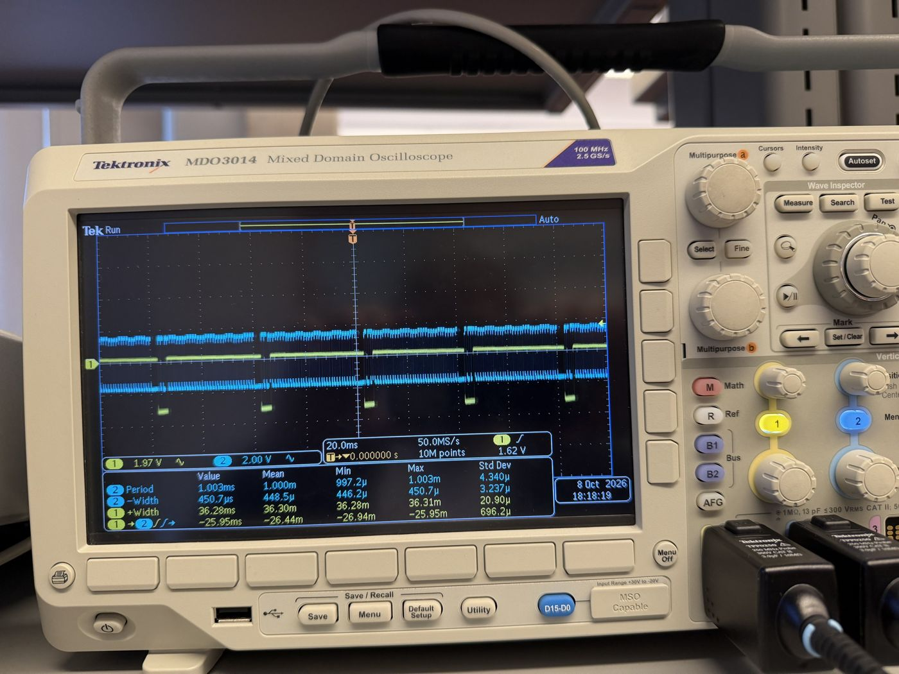
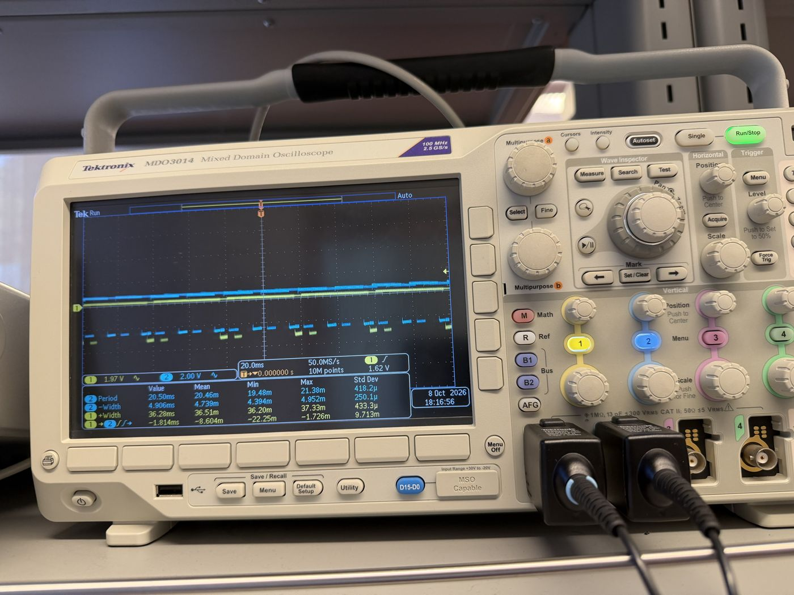

# STM32 Portable Oscilloscope

[](https://github.com/MykolaBohomaz/MiniOsciloscope/actions/workflows/ci.yml)

A pocket digital oscilloscope built on an **STM32L432KC** (Arm Cortex-M4, 80 MHz).
It samples a signal at up to **5 million samples per second**, triggers on it,
draws it on a 192×96 LCD with live measurements, and can send captures to a PC
over USB. The firmware is written in C on top of the STM32 HAL, with no RTOS.

<p align="center">
  
</p>
<p align="center"><sub>The working prototype measuring its own 1 kHz test signal:
2.50 V peak-to-peak, 1.65 V average, 1.88 V RMS (theory: 1.87 V), 1.00 kHz, 50.0 % duty cycle.</sub></p>

## What it does

- **Captures waveforms** with the chip's 12-bit ADC at 5 µs/div to 500 ms/div (16 time bases).
- **Triggers** on a rising or falling edge in AUTO, NORMAL or SINGLE mode, and shows
  what happened *before* the trigger too (10–90 % pre-trigger).
- **Measures** peak-to-peak, average, RMS, frequency and duty cycle on every capture.
- **Displays** the waveform at 25 frames per second on an ST75256 LCD.
- **Talks to a PC** through a Python tool (`tools/scope.py`): change settings,
  read measurements, download captures as CSV.
- **Tests itself** with a built-in signal generator (the chip's DAC) wired back into the input.

## How it works


```mermaid
flowchart LR
    TIM6["Timer<br/>(sample clock)"] -- triggers --> ADC["12-bit ADC<br/>pin A0"]
    ADC -- "DMA, no CPU" --> RING[("16k-sample<br/>circular buffer")]
    RING --> TRIG["Trigger search"]
    TRIG --> MEAS["Measurements"]
    TRIG --> DRAW["Draw frame"]
    MEAS --> DRAW
    DRAW -- "SPI + DMA" --> LCD["LCD"]
    MEAS --> PC["USB → Python tool"]
```

- **Sampling never touches the CPU.** A hardware timer starts each ADC conversion,
  and DMA copies every result into a circular buffer in RAM. So the sample timing
  is exact, whatever the rest of the code is doing.
- **The trigger is software.** The main loop scans new samples for an edge (with
  hysteresis, so noise can't fire it), then waits for the rest of the record. If the
  loop ever falls so far behind that the DMA might have overwritten part of a record,
  that record is thrown away and counted. A corrupted waveform is never shown.
- **The display doesn't block either.** Each frame is drawn into one buffer while the
  previous one is sent to the LCD by SPI DMA in the background.
- **One simple main loop, no RTOS.** Interrupts only set flags; the loop does the work.
  A watchdog resets the chip if anything hangs, and a boot self-check refuses to run
  if the peripheral configuration was broken by regenerating the CubeMX project.

## Results

All numbers were measured on the hardware above, using a Tektronix MDO3014 bench
oscilloscope on the firmware's debug pins, and the Python tool.

| | Result |
|---|---|
| Waveforms captured per second | **up to 1000** (fastest time base, 1 kHz input) |
| Display refresh rate | **25.0 FPS** (frame period 40.01 ms, jitter 31 µs) |
| Time to send one frame to the LCD | **3.71 ms** for 2304 bytes over SPI DMA (theory: 3.69 ms) |
| Time to process one capture | **0.55 ms** (200 samples) to **15.7 ms** (15 238 samples) |
| Noise floor | **1.18 mV RMS** at 5 MS/s: about 9.7 of the 12 bits are above the noise |
| Unit tests | **1209 checks** run on every push in CI, with memory/UB sanitizers |

<p align="center">
  
  
</p>
<p align="center"><sub>Timing measured on the bench scope. Yellow: LCD chip select (low while a frame is sent).
Blue: a debug pin that is high while a capture is processed. Left: fastest time base; right: 500 µs/div.</sub></p>

Raw numbers: [docs/validation/results.md](docs/validation/results.md).

**Found while testing:**

- At 5 MS/s the ADC only has 31 ns to sample. With a 667 Ω source it read **2.3 % low**,
  while slower settings read correctly. That is why the next board drives the input
  through a buffer amplifier.
- Processing a long capture (15.7 ms) is the bottleneck: at 500 µs/div the scope is
  only "live" 23 % of the time. No data is lost (sampling pauses while it runs), but
  the next step is a faster single-pass version of that code.

## Hardware

- NUCLEO-L432KC board (STM32L432KC + built-in ST-LINK programmer)
- ERM19296FSF-1 192×96 LCD module (ST75256 controller), 4-wire SPI
- Optional: rotary encoder and 3 push buttons (RUN, SINGLE, MENU)

| Signal | Nucleo pin | | Signal | Nucleo pin |
|---|---|---|---|---|
| Scope input | A0 | | LCD clock / data | A1 / A6 |
| Test signal out | A3 | | LCD CS / A0 / reset | D3 / D6 / D12 |
| Encoder A / B / push | D9 / D1 / D0 | | Backlight | A2 |
| RUN / SINGLE / MENU | D11 / D5 / D4 | | Debug timing pins | D10, D2 |

Full wiring for the 20-pin display, grounding and power: [docs/hardware.md](docs/hardware.md).
First power-on steps: [docs/bringup-checklist.md](docs/bringup-checklist.md).

> **Safety:** on this prototype the input goes straight into the microcontroller.
> Only apply 0–3.3 V. It is not rated for mains voltage.

## Getting started

**Flash it (no toolchain needed):** plug in the Nucleo and copy
[`prebuilt/scope.bin`](prebuilt) onto the `NODE_L432KC` drive that appears.
To test without any external signal, put a jumper wire from **A3 to A0**.

**Use the PC tool:**

```sh
pip install -r tools/requirements.txt
python3 tools/scope.py gen sine 1000      # turn on the 1 kHz test signal
python3 tools/scope.py meas               # read the measurements
python3 tools/scope.py timebase 6         # 500 µs/div
python3 tools/scope.py capture -o cap.csv --plot
python3 tools/scope.py contrast --sweep   # tune the LCD contrast
```

**Build from source:** open the folder in STM32CubeIDE (*File → Import → Existing
Projects into Workspace*), or use CMake with the Arm GCC toolchain:

```sh
cmake -B build -G Ninja -DCMAKE_TOOLCHAIN_FILE=cmake/arm-none-eabi.cmake
cmake --build build
```

**Run the unit tests on a PC:**

```sh
cmake -S tests -B build-tests && cmake --build build-tests
ctest --test-dir build-tests --output-on-failure
```

## Project structure

```
Core/App/     the oscilloscope firmware (acquisition, trigger, measurements, LCD, UI, PC link)
Core/Src,Inc  STM32CubeMX-generated peripheral setup
tests/        unit tests that run on a PC (CI)
tools/        scope.py (PC tool), bench.py (measurement scripts)
prebuilt/     ready-to-flash firmware
docs/         hardware wiring, bring-up steps, PC protocol, test results
```

## Next steps

- Faster capture processing (see "Found while testing").
- An input front end with protection and ±30 V / ±50 V ranges on a custom PCB.
- Long-run and sample-clock accuracy tests (in progress).

## License

MIT (see [LICENSE](LICENSE)). The STM32 HAL and CMSIS under `Drivers/` keep their ST/Arm licenses.
